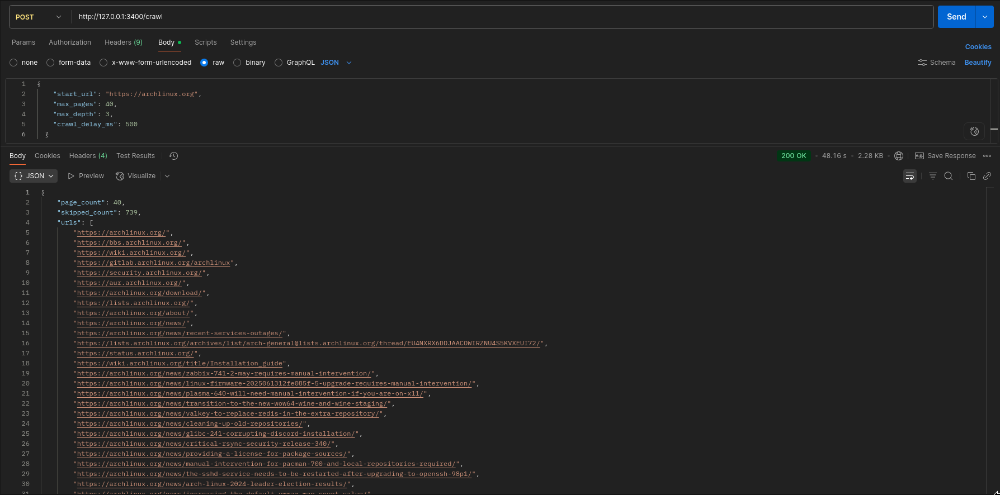
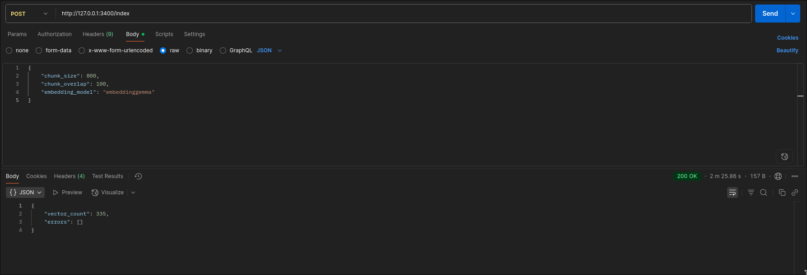
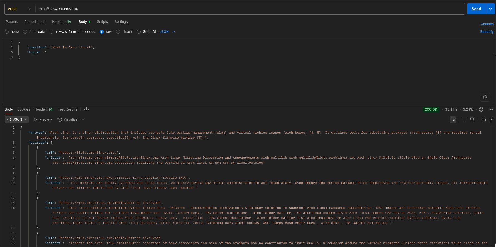

## API Usage Examples

Below are sample screenshots demonstrating each primary endpoint in the pipeline.

### 1. Crawl Endpoint (`POST /crawl`)

Purpose: Fetch pages (polite, robots-aware) from the starting URL, persist latest crawl to `data/crawl/`.

Request body fields:

- `start_url` (string, required)
- `max_pages` (int)
- `max_depth` (int)
- `crawl_delay_ms` (int, ms between requests)

Response shape:

```
{
	"page_count": <int>,
	"skipped_count": <int>,
	"urls": ["https://...", ...]
}
```

Screenshot:


### 2. Index Endpoint (`POST /index`)

Purpose: Chunk latest crawl text, embed with the configured embedding model (e.g. EmbeddingGemma), and store vectors in the Chroma collection.

Request body fields:

- `chunk_size` (int)
- `chunk_overlap` (int < chunk_size)
- `embedding_model` (string; must exist in Ollama)

Response shape:

```
{
	"vector_count": <int>,
	"errors": ["..."]
}
```

Screenshot:


### 3. Ask Endpoint (`POST /ask`)

Purpose: Retrieve top‑k relevant chunks, build a grounded prompt, generate an answer with inline citations, and return answer + sources + timings.

Request body fields:

- `question` (string)
- `top_k` (int)

Response shape:

```
{
	"answer": "... with [1] style citations ...",
	"sources": [ { "url": "https://...", "snippet": "..." }, ... ],
	"timings": {
		"retrieval_ms": <int>,
		"generation_ms": <int>,
		"total_ms": <int>
	}
}
```

Screenshot:


### End-to-End Flow

1. `/crawl` → persists pages
2. `/index` → builds vector store
3. `/ask` → answers grounded on stored chunks

Ensure Ollama is running and models (generation + embedding) are pulled before invoking `/index` or `/ask`.
